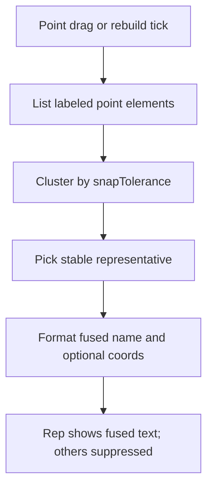

# 重合点融合标签设计

**日期：** 2026-08-02  
**状态：** 已共识，待实现  
**范围：** 数学函数画布（`math/graph`）及共享点标签层（`math/shared`）

---

## 1. 问题

画板上多个几何点常因吸附叠在同一位置（用户点、交点、垂足、特征点等）。每个点各自带坐标标签时，会出现两套几乎相同的坐标文案叠在一起，难读且显得「错了」。

特征点创建路径已有精确合并（`MERGE_EPS`）先例，但**运行时**由 snap 造成的多类点重合尚无统一处理。

## 2. 目标与非目标

### 目标

- 当带标签的点在 **snap 容差** 内重合时，界面只显示 **一条** 融合标签。
- 文案格式：**名字用 `·` 拼接 + 坐标只写一份**，例如 `U1·交点(2, 3)`。
- 点散开（超出容差）后，各自恢复原有标签。
- 几何对象、依赖链、选中与样式面板行为不变（纯显示层）。

### 非目标

- 不把多个几何点语义合并成一个 JSXGraph 点。
- 不新做独立 DOM 气泡层。
- 不改特征点在 `rebuild` 时的 `MERGE_EPS` 创建逻辑（保留；融合层在其之上叠加显示规则）。
- 不改线段/路径量测标签（长度、斜率等）。

## 3. 产品规则

| 项 | 约定 |
|----|------|
| 触发容差 | 与 `snapTolerance(board)` 相同（约 12 屏幕像素 → 用户坐标 `tolX`/`tolY`） |
| 判定 | 轴对齐盒：`\|Δx\| ≤ tolX && \|Δy\| ≤ tolY`（与 `snapCoordsAdvanced` 点吸附一致） |
| 参与对象 | 所有带点坐标标签的可见点：用户点、交点、垂足、特征点等（`elType` 为 `point` / `glider` / `perpendicularpoint`，且已绑定 live label / 有 `_mathBaseName`） |
| 排除 | 隐藏辅助点、`_mathExtendRay`、无标签或已移除的元素；路径中点量测 `text` |
| 文案 | `names.join('·')`；若簇内任一成员 `_mathShowCoords === true`，再追加一份 `formatCoordsPair(x, y)`（坐标取代表点当前位置） |
| 关坐标 | 簇内全部 `_mathShowCoords === false` 时，只显示拼接名字 |
| 代表点 | 稳定选取，避免拖动时标签在成员间闪跳。优先级：用户点 → 交点 → 垂足 → 特征点 → 其它；同级按 `_mathBaseName` / id 字符串升序 |
| 非代表点 | 标签文案置空（或等效隐藏），不改短名身份与几何 |
| 选中 | 仍可选中簇内任一几何点；样式面板改某一成员的「显示坐标」后，下一 tick 按整簇规则重算 |

## 4. 架构

### 模块边界

| 模块 | 职责 |
|------|------|
| 新建 `math/shared/point-label-fusion.js` | 纯逻辑：聚类、代表点选择、融合文案、suppress 标记读写；可单测 |
| `math/shared/board-label.js` | 在 `ensurePointGeomHook` 的 `run` 末尾（自身 live tick + 依赖 tick 之后）调用 board 级 `refreshPointLabelFusion`；`setLabelContent` 尊重 `_mathLabelFusionSuppressed` |
| `math/graph/index.js` | 提供 `listLabeledPointElements()`（可基于现有 `listSnapTargets` 过滤）；在 controller / draw host 上挂 `refreshPointLabelFusion`；曲线重建、恢复点之后主动 refresh 一次 |
| `board-snap.js` | 不改 API；fusion 复用 `snapTolerance` |

禁止把聚类逻辑堆回 `graph/index.js` 或继续膨胀 `draw-tools` 兼容层。

### 数据约定（元素字段）

- `_mathLabelFusionSuppressed: boolean` — 本 tick 是否应隐藏标签
- `_mathLabelFusionClusterId`（可选，调试用）— 当前簇标识
- 代表点的 `getText` / tick 路径：若自己是代表，输出融合串；否则输出空串（或由统一 refresh 写 label）

推荐实现形态：**board 级统一 refresh**，而不是每个点的 `getText` 各自扫描全板（避免 O(n²) 重复与互相覆盖）：

1. 收集候选点  
2. 算簇与代表  
3. 对每个点：设 suppress；代表调用 `setLabelContent(el, fusedText)`，非代表 `setLabelContent(el, '')`  
4. 下一帧散开时同样走 refresh，清除 suppress 并恢复各点原 `getText`

各点原有 `_mathLiveLabelTick` 仍可先跑（写「单点文案」），随即以 board refresh **覆盖**为融合结果；或让 tick 只登记 dirty，由 refresh 唯一写 label。优先后者若改动便宜，否则采用「tick 后覆盖」以保证正确性。

## 5. 刷新时机

- 任意参与点的 `ensurePointGeomHook` run（拖动 / snap）
- 用户点创建、删除、恢复后
- 构造（交点、垂足等）创建 / 删除 / restore 后
- 特征点随曲线 rebuild 重建后
- 「显示坐标」切换后（现有 style / `setShowCoords` 已触发 live tick；需确保随后 fusion refresh）

可用 `frame-task.js` 合并同一帧内多次 refresh，避免拖动时重复全量聚类。

## 6. 测试

| 用例 | 期望 |
|------|------|
| 两用户点间距在 tol 内 | 一条 `U1·U2(x, y)`，另一标签空 |
| 超出 tol | 各自恢复 |
| 用户点 + 交点重合 | `U1·交点(…)`（名字顺序稳定） |
| 仅一员开坐标 | 仍显示一份坐标 |
| 全员关坐标 | 仅 `U1·交点` |
| 代表点优先级 | 用户点优先于交点成为代表 |
| 结构 | fusion 模块存在；geom hook / rebuild 路径会调用 refresh |

测试文件建议：`test/web/math-point-label-fusion.test.cjs`（纯函数为主）。

## 7. 风险与边界

- **标签闪烁**：必须稳定代表点排序；同帧只 refresh 一次。  
- **与 autoPosition**：非代表清空后，JSXGraph 只避让代表标签，符合预期。  
- **垂足 `autoPosition: false`**：若垂足为代表，保持其 offset；若非代表则清空即可。  
- **特征点已合并名**：`顶点·零点` 已是单一 `_mathBaseName`，再与用户点融合时整段当作一个名字参与 `·` 拼接。

## 8. 验收

1. 将用户点吸附到交点/特征点上，画面只见一条融合坐标标签。  
2. 拖开后恢复两条独立标签。  
3. 样式面板关闭某一成员「显示坐标」时，只要簇内还有成员开着，融合标签仍带坐标。  
4. 选中、删除、构造依赖行为与改前一致。
