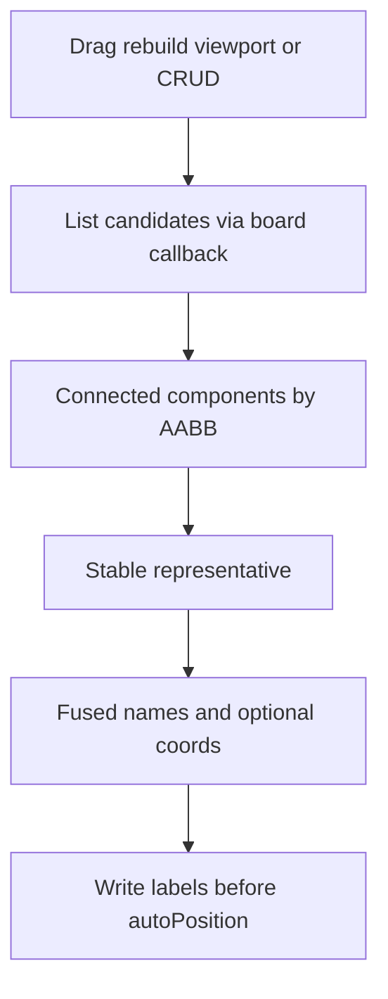

# 重合点融合标签设计

**日期：** 2026-08-02  
**状态：** 已共识，待实现  
**范围：** 数学函数画布（`math/graph`）及共享点标签层（`math/shared`）

---

## 1. 问题

画板上多个几何点常因吸附叠在同一位置（用户点、交点、垂足、特征点等）。每个点各自带坐标标签时，会出现两套几乎相同的坐标文案叠在一起，难读且显得「错了」。

特征点创建路径已有精确合并（`MERGE_EPS`）先例，但**运行时**由 snap 造成的多类点重合尚无统一处理。

## 2. 目标与非目标

### 目标

- 当带标签的点在 **snap 容差** 内重合时，界面只显示 **一条** 融合标签。
- 文案格式：**名字用 `·` 拼接 + 坐标只写一份**，例如 `U1·交点(2, 3)`。
- 点散开（超出容差）后，各自恢复原有标签。
- 几何对象、依赖链、选中与样式面板行为不变（纯显示层）。

### 非目标

- 不把多个几何点语义合并成一个 JSXGraph 点。
- 不新做独立 DOM 气泡层。
- 不改特征点在 `rebuild` 时的 `MERGE_EPS` 创建逻辑（保留；融合层在其之上叠加显示规则）。
- 不改线段/路径量测标签（长度、斜率等）。

## 3. 产品规则

| 项 | 约定 |
|----|------|
| 触发容差 | 与 `snapTolerance(board)` 相同（约 12 屏幕像素 → 用户坐标 `tolX`/`tolY`） |
| 成对邻近 | 轴对齐盒：`\|Δx\| ≤ tolX && \|Δy\| ≤ tolY`（与 `snapCoordsAdvanced` 点吸附一致） |
| 聚类 | **AABB 邻接的连通分量**（union-find / BFS）。若 A≈B 且 B≈C，则 A、B、C 同一簇，即使 A≉C |
| 参与对象 | 见 §3.1 候选过滤 |
| 文案 | 名字按 §3.2 排序后 `join('·')`；同名不去重（两「交点」保留两次，避免 silently 丢成员）；若簇内任一 `_mathShowCoords === true`，追加一份 `formatCoordsPair`（坐标取代表点当前 `X()/Y()`） |
| 关坐标 | 簇内全部 `_mathShowCoords === false` 时，只显示拼接名字 |
| 代表点 | 按角色优先级选最低 rank；同级再按 `_mathBaseName`、再按稳定 id（`el.id` 或 `_mathConstrId`/`用户点 id` 字符串）升序 |
| 非代表点 | 标签文案置空，不改短名身份与几何 |
| 选中 | 仍可选中簇内任一几何点；改某一成员「显示坐标」后，下一 refresh 按整簇规则重算 |

### 3.1 候选过滤（必须同时满足）

- `elType` ∈ `{ point, glider, perpendicularpoint }`
- 未移除：`!el._is_removed`
- 非延长辅助：`!el._mathExtendRay`
- 可见：`el.visProp?.visible !== false`（及等价 `getAttribute('visible')` 若已接）
- 有点身份名：`typeof el._mathBaseName === 'string' && el._mathBaseName`
- 已绑定点标签：`el._mathLiveLabelBound === true`（排除隐藏辅助点、路径中点 `text`）
- 交点额外：若存在 `_mathIntersectOnBody`，则必须 `!== false`（与 `object-select` 一致，延长线外隐藏交点不参与）

### 3.2 角色判定 `classifyPointRole(el)` → rank

| rank | role | 判定（按序匹配，先中先定） |
|------|------|---------------------------|
| 0 | `user` | `el._mathUserPoint === true` |
| 1 | `intersect` | `el._mathConstrKind === 'intersect'` |
| 2 | `foot` | `el.elType === 'perpendicularpoint'` 或（`_mathConstrKind === 'perp'` 且为点） |
| 3 | `feature` | `el._mathFeatureMark === true`（rebuild 特征点时显式打标） |
| 4 | `other` | 其余候选 |

名字列表顺序与代表点排序使用**同一比较器**（先 rank，再 baseName，再 id），因此代表名 naturally 排在融合串最前。

## 4. 架构

### 4.1 模块边界与注册契约

| 模块 | 职责 |
|------|------|
| 新建 `math/shared/point-label-fusion.js` | 纯函数：`classifyPointRole`、`clusterLabeledPoints`、`formatFusedPointLabel`、`applyFusionToCluster`；**不** import `graph` |
| `math/shared/board-label.js` | 导出 `setLabelContent`（或 `writeElementLabel`）；`ensurePointGeomHook` 的 `run` 在 live/dep ticks **之后**、`label.updateText` / `setAutoPosition` **之前** 调用 `board._mathRefreshPointLabelFusion?.()`；未注册则 no-op。单点 tick 若见 `_mathLabelFusionSuppressed` 则写空串短路 |
| `math/shared/board-snap.js` | 不改 API；fusion 复用 `snapTolerance` |
| `math/shared/frame-task.js` | CRUD / 视口变更路径用 `createFrameTask` 合并同帧多次 schedule |
| `math/graph/index.js` | mount 时注册：`board._mathListLabeledPoints`、`board._mathRefreshPointLabelFusion`（内部 list → cluster → apply）；dispose 时清掉回调并 `cancel` frame task；特征点创建处设 `_mathFeatureMark = true` |

**禁止** `board-label` / `point-label-fusion` 直接 import `graph`。非 graph 画板不注册回调 → fusion 不生效。

### 4.2 写入策略（避免闪一帧）

- **拖动路径（geom hook）**：同一次 `run` 内 **同步** 调用 `board._mathRefreshPointLabelFusion()`，在 `updateText`/`setAutoPosition` 之前完成 suppress/融合写入。
- **CRUD / rebuild / 视口变更**：`schedule()` 到 `createFrameTask`，同帧多次合并为一次；task 内执行同一 refresh。
- 统一 refresh 是 **唯一** 写融合结果的权威路径：对代表 `setLabelContent(el, fusedText)` 并 `_mathLabelFusionSuppressed = false`；对非代表 `setLabelContent(el, '')` 并 `_mathLabelFusionSuppressed = true`；对已不在任何多点簇的点清除 suppress，并用该点原 `_mathLiveLabelTick` / 绑定的 getText 恢复单点文案。

### 4.3 元素字段

- `_mathLabelFusionSuppressed: boolean`
- `_mathFeatureMark: boolean`（仅特征点）
- `_mathLabelFusionClusterId`（可选，调试）

## 5. 刷新时机

必须调度 refresh 的路径：

1. 参与点的 `ensurePointGeomHook` run（同步）
2. 用户点创建 / 删除 / 恢复后
3. 构造（交点、垂足等）创建 / 删除 / restore 后
4. 特征点随曲线 rebuild 重建后
5. 「显示坐标」切换后（`setShowCoords` / 样式面板）
6. **视口变更**：图例改 bbox、滚轮缩放、导航缩放/平移、罗盘回到原点等会改变 `unitX`/`unitY`（从而改变 tol）的路径 — 均 `schedule` 同一 fusion frame task

## 6. 测试

文件：`test/web/math-point-label-fusion.test.cjs`（纯函数为主）+ 既有结构/接线断言补强。

| 用例 | 期望 |
|------|------|
| 两用户点在 tol 内 | 一条 `U1·U2(x, y)`，另一标签空 |
| 超出 tol | 各自恢复 |
| 三点传递簇 A≈B≈C | 同一连通分量，一条融合标签 |
| 用户点 + 交点 | 用户点为代表；文案 `U1·交点(…)` |
| 仅一员开坐标 | 仍显示一份坐标 |
| 全员关坐标 | 仅拼接名字 |
| 不可见 / `_mathIntersectOnBody === false` | 不入候选 |
| 删簇内一员 | 剩余若仍 ≥2 则重算；若只剩 1 则恢复单点标签 |
| 名字序 | 同比较器；重复 baseName 不去重 |
| 接线 | rebuild、delete、viewport、setShowCoords 会调用 refresh/schedule；`board-label` 不 import `graph`；特征点带 `_mathFeatureMark` |

## 7. 风险与边界

- **标签闪烁**：稳定代表排序；拖动路径同步 refresh；CRUD 用 frame-task。
- **autoPosition**：fusion 在 `setAutoPosition` 前写入，空标签不参与有效避让。
- **垂足 `autoPosition: false`**：为代表时保持其 offset；非代表清空即可。
- **特征点已合并名**：`顶点·零点` 是单一 `_mathBaseName`，再与其它点融合时整段当作一个名字。

## 8. 验收

1. 将用户点吸附到交点/特征点上，画面只见一条融合坐标标签。  
2. 拖开后恢复两条独立标签。  
3. 样式面板关闭某一成员「显示坐标」时，只要簇内还有成员开着，融合标签仍带坐标。  
4. 缩放改变 tol 后，该合则合、该拆则拆。  
5. 选中、删除、构造依赖行为与改前一致。
